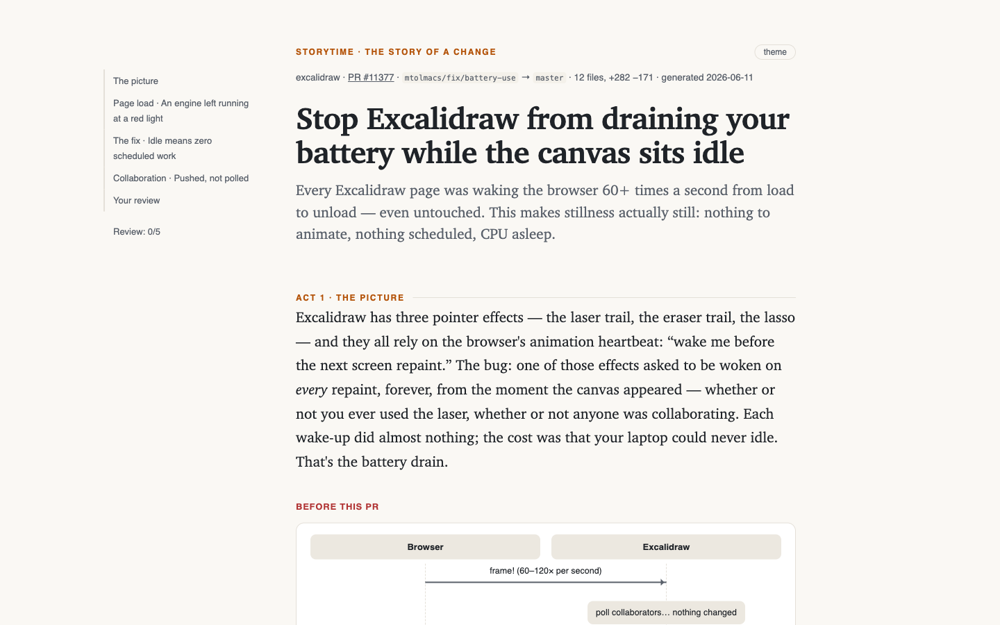

# storytime

**`/storytime` — the story of a change, not another AI review.**

AI made writing code ~10× faster. Reviewing it didn't speed up at all — PRs grew
+154% and review time +91%, 71% of PRs get self-merged, and reviewers approve
code nobody on the team fully understands. Every AI review tool answers this by
hunting more bugs. None of them answer the question reviewers actually spend
their time on: ***what is this change, and how do I even read it?***

`storytime` is a free, open-source skill that turns any PR, branch, or diff
into **the story of the change** — a self-contained interactive page, in three
acts:

- **Act 1 — The picture.** What the change means in human words — readable by
  anyone in under a minute — with before/after sequence diagrams of who talks
  to whom, and a timeline of how the feature lives. Zero code, zero jargon.
- **Act 2 — The journey.** Scenes keyed to moments ("Day 0: you connect…",
  "Six hours later…"), not files. Hard terms get plain-words cards with an
  everyday analogy the moment they appear. The code is always one click away
  behind "show me the code" toggles — never blocking the story.
- **Act 3 — Your review.** The homework, done: an interactive checklist where
  every card is a question worth your judgment ("Could someone stay logged in
  forever?"), **what was found in the code**, and your concrete move. Tick
  them off; when they're all done, you've covered what matters.

Every claim is backed by real code behind the toggles, inferred intent is
visibly hedged, and it never gives a verdict: a story, not a judgment. The
call stays yours.



## Install

```bash
npx skills add xrutayisire/storytime
```

[`skills`](https://github.com/vercel-labs/skills) installs the skill for the
agents you use — Claude Code, Codex, Cursor, and 40+ others.

## Use

```
/storytime                              # working tree, or your branch vs main
/storytime 1234                         # a PR by number
/storytime https://github.com/o/r/pull/5  # a PR by URL
/storytime feat/my-branch               # a branch
/storytime abc123..def456               # a commit range
/storytime 1234 --out story.html        # keep the file where you want it
```

The story opens in your browser — act navigation, rendered diagrams, code
toggles, a persistent review check-off, light/dark, works offline, zero
dependencies.

## See it on real PRs

| Story | The change |
|---|---|
| [tldraw #9028](https://xrutayisire.github.io/storytime/examples/tldraw-pr-9028/story.html) | Hover a shape, press shift+Q, and the next shape is born wearing its style |
| [excalidraw #11377](https://xrutayisire.github.io/storytime/examples/excalidraw-pr-11377/story.html) | Stop the canvas from draining your battery while it sits idle |
| [vite #22572](https://xrutayisire.github.io/storytime/examples/vite-pr-22572/story.html) | A security fix that teaches you Windows alternate paths along the way |
